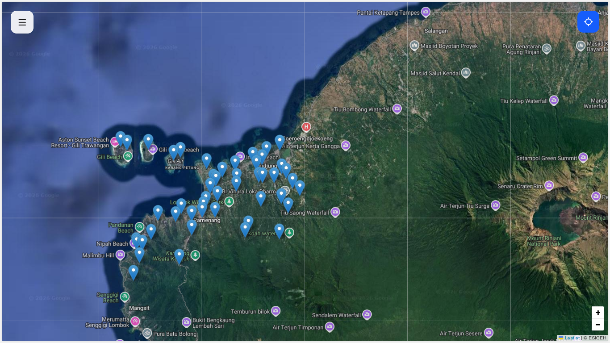
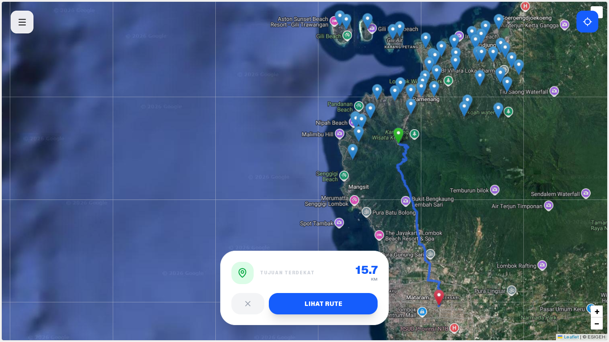
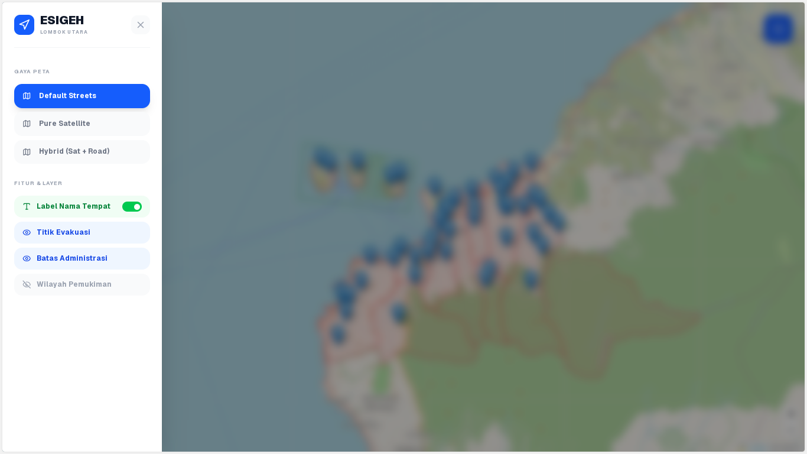
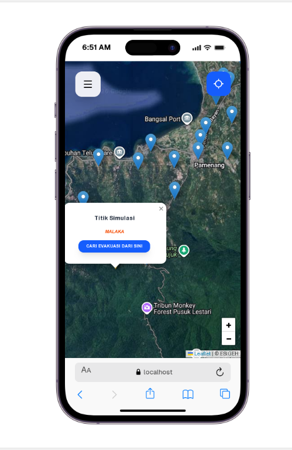

# ESIGEH: Sistem Informasi Geografis Jalur Evakuasi Gempa
**Wilayah Fokus Tanjung & Pemenang, Lombok Utara**

ESIGEH adalah aplikasi berbasis web yang dibuat untuk membantu warga Lombok Utara menemukan jalur evakuasi tercepat saat terjadi gempa. Aplikasi ini bukan cuma peta biasa, tapi sistem yang bisa menghitung rute terbaik lewat jalan raya asli menuju titik aman (shelter) terdekat dari lokasi kita.



## Fitur yang Sudah Jadi

Aplikasi ini sudah fungsional dan bisa langsung dipakai untuk simulasi maupun navigasi di lapangan:

- **Deteksi Lokasi Otomatis (GPS)**
  Sekali klik, aplikasi langsung tahu posisi Anda dan mencarikan shelter terdekat.

- **Navigasi Rute Jalan Raya**

  Garis biru yang muncul mengikuti jalan asli, bukan garis lurus, jadi lebih akurat untuk evakuasi.

- **Simulasi Titik Mana Saja (Long-Press)**

  Anda bisa tekan lama di mana saja pada peta untuk mencari rute seolah-olah Anda sedang di sana. Berguna buat bantuin keluarga di tempat lain.

- **Info Daerah Otomatis**

  Setiap titik yang dipilih akan muncul info nama desanya (via Geocoding).

- **Ganti Gaya Peta & Layer**

  Bisa ganti ke tampilan Satelit, Hybrid, atau Jalanan. Bisa juga nyalain/matiin layer Batas Desa dan wilayah Pemukiman.



## Apa yang Lagi Dikembangkan?

- Panel Admin
- Offline Mode
- Notifikasi Gempa



## Teknologi yang Digunakan

- **Frontend**: React.js & Leaflet (Peta).
- **Styling**: Tailwind CSS (Versi 4).
- **Backend**: Node.js & Express.
- **Database**: PostgreSQL dengan ekstensi PostGIS (untuk olah data geografis).

---

## Panduan Instalasi (Langkah demi Langkah)

Pastikan di laptop Anda sudah terinstal **Node.js** dan **PostgreSQL**.

### 1. Persiapan Database
1. Buka PostgreSQL Anda (bisa lewat pgAdmin atau terminal).
2. Pastikan ekstensi **PostGIS** sudah terinstal.

### 2. Setup Server (Backend)
1. Masuk ke folder server:
   ```bash
   cd server
   ```
2. Instal semua bahan:
   ```bash
   npm install
   ```
3. Copy file `.env` (atau buat baru) dan isi dengan detail database Anda:
   ```env
   DB_HOST=localhost
   DB_PORT=5432
   DB_USER=postgres
   DB_PASSWORD=isi_password_anda
   DB_NAME=esigeh
   PORT=5000
   ```
4. Jalankan script untuk memindahkan data dari QGIS ke database:
   ```bash
   node scripts/migrate.js
   node scripts/migrate_extra.js
   ```
5. Jalankan servernya:
   ```bash
   node index.js
   ```

### 3. Setup Client (Frontend)
1. Buka terminal baru, masuk ke folder client:
   ```bash
   cd client
   ```
2. Instal semua bahan:
   ```bash
   npm install
   ```
3. Jalankan aplikasinya:
   ```bash
   npm run dev
   ```
4. Buka browser di alamat `http://localhost:5173`.

---

## Cara Penggunaan
- **Cari Lokasi**: Klik tombol icon GPS (kanan atas). Jangan lupa klik "Allow" saat browser minta izin lokasi.
- **Simulasi**: Tekan lama (atau klik kanan di laptop) pada area mana saja di peta untuk menaruh marker kuning, lalu klik "Cari Dari Sini".
- **Ganti Tampilan**: Klik icon menu (kiri atas) untuk memunculkan sidebar. Di sana Anda bisa pilih mode Satelit atau nyalakan layer Batas Desa.



*Aplikasi ini dikembangkan untuk tujuan mitigasi bencana. Data jalur evakuasi berdasarkan hasil riset awal di wilayah Kabupaten Lombok Utara dan bisa saja berubah kedepannya karena masih tahap pengembangan.*
